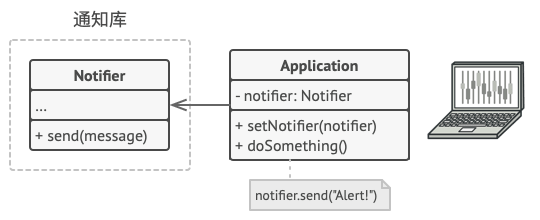

# 装饰模式

装饰者模式、装饰器模式、Wrapper、Decorator

为对象提供加强的接口

## 意图

装饰模式是一种结构型设计模式， 允许你通过将对象放入包含行为的特殊封装对象中来为原对象绑定新的行为。

当你需要更改一个对象的行为时， 第一个跳入脑海的想法就是扩展它所属的类。 但是， 你不能忽视继承可能引发的几个严重问题。

+ 继承是静态的。 你无法在运行时更改已有对象的行为， 只能使用由不同子类创建的对象来替代当前的整个对象。
+ 子类只能有一个父类。 大部分编程语言不允许一个类同时继承多个类的行为。

## 装饰模式优缺点

✅ 你无需创建新子类即可扩展对象的行为。  
✅ 你可以在运行时添加或删除对象的功能。  
✅ 你可以用多个装饰封装对象来组合几种行为。  
✅ 单一职责原则。 你可以将实现了许多不同行为的一个大类拆分为多个较小的类。

❌ 在封装器栈中删除特定封装器比较困难。  
❌ 实现行为不受装饰栈顺序影响的装饰比较困难。  
❌ 各层的初始化配置代码看上去可能会很糟糕。  

## 装饰模式的使用场景

+ 如果希望再无需修改代码的情况下即可使用对象，并且希望在运行时为对象新增额外的行为，可以使用装饰模式。
  + 装饰能将业务逻辑组织为层次结构， 你可为各层创建一个装饰， 在运行时将各种不同逻辑组合成对象。 由于这些对象都遵循通用接口， 客户端代码能以相同的方式使用这些对象。
  
+ 如果用继承来扩展对象行为的方案难以实现或者根本不可行， 你可以使用该模式。
  + 使用了final关键词来对某个类的扩展进行了限制。复用最终类的唯一行为就是使用装饰模式：用封装器对其进行封装。