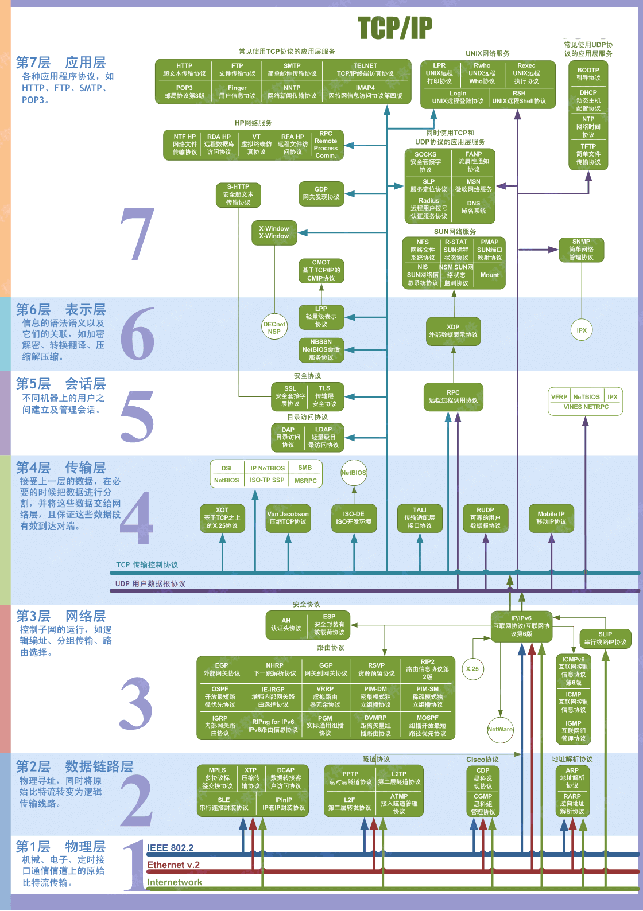

## OSI七层模型

| 七层模型     | 解释                      |
|----------|-------------------------|
| 7. 应用层   | 为计算机用户提供服务              |
| 6. 表示层   | 数据处理(编码, 加密解密)          |
| 5. 会话层   | 管理应用程序之间的会话             |
| 4. 传输层   | 为两台主机进程之间的通信提供通用的数据传输服务 |
| 3. 网络层   | 路由和寻址                   |
| 2. 数据链路层 | 帧编码和误差纠正控制              |
| 1. 物理层   | 透明地传送bit传输              |  

