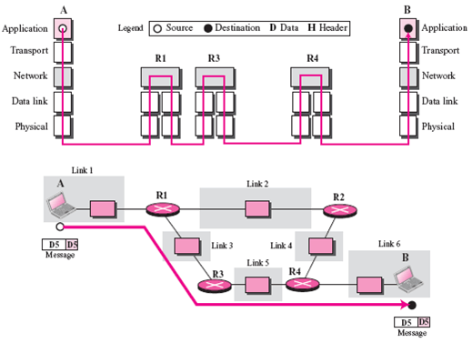
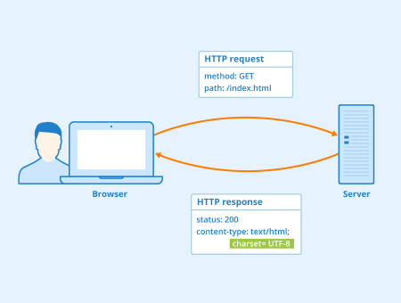
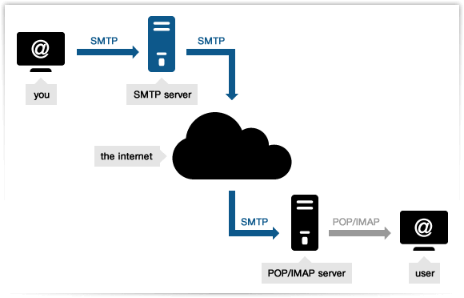
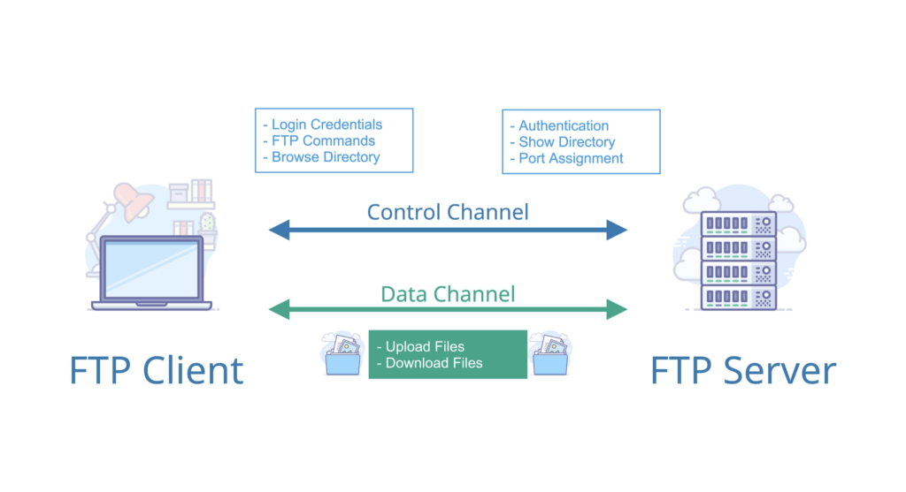
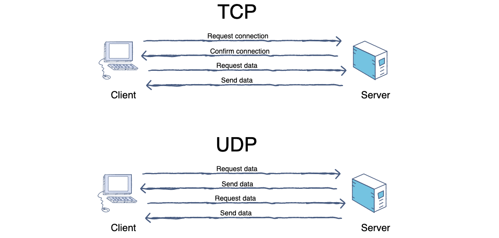

## TCP/IP 七层模型

TCP/IP 四层模型 是目前被广泛采用的一种模型,我们可以将 TCP / IP 模型看作是 OSI 七层模型的精简版本，由以下 4 层组成：

1. 应用层（Application layer）：应用层位于传输层之上，主要提供两个终端设备上的应用程序之间信息交换的服务，它定义了信息交换的格式，消息会交给下一层传输层来传输。 我们把应用层交互的数据单元称为报文。
   

+ 应用层常用协议
    + HTTP:超文本传输协议  
      
    + SMTP:简单邮件传输(发送)协议
      
    + POP3/IMAP:邮件接收的协议
    + FTP:文件传输协议
      
    + Telnet:远程登陆协议，Telnet的最大缺点是所有数据都以明文的形式发送，有安全问题风险问题，已渐渐被SSH替代
    + SSH:安全的网络传输协议，建立在传输协议TCP上
      

3. 传输层
4. 网络层
5. 网络接口层